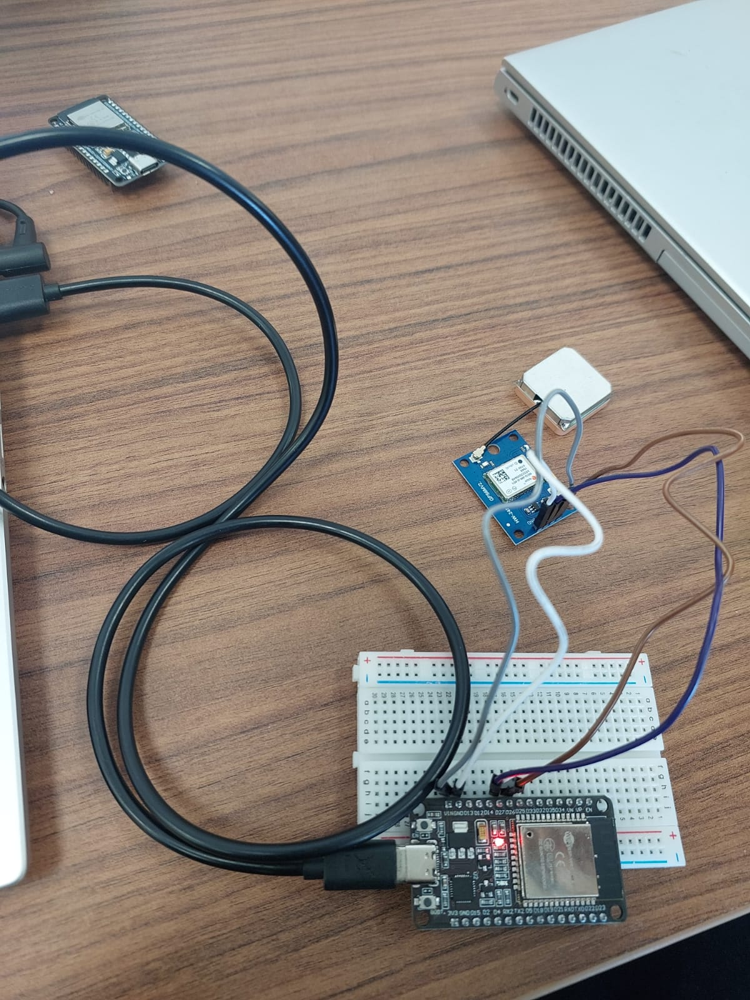
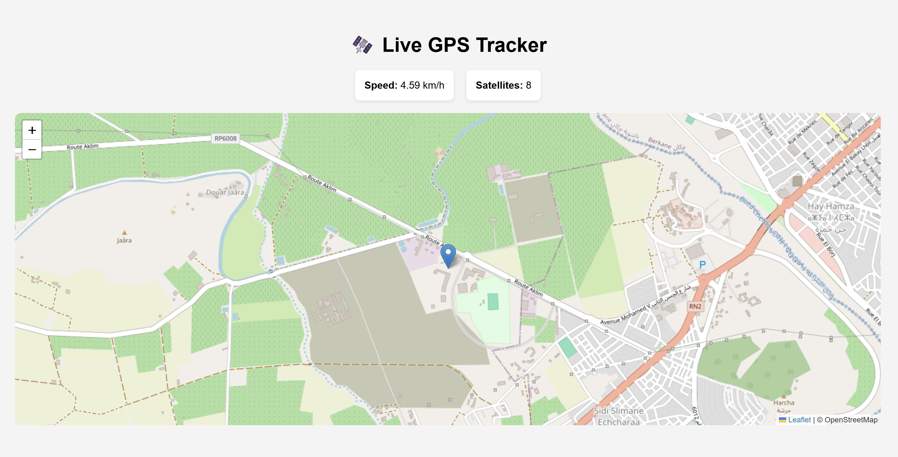
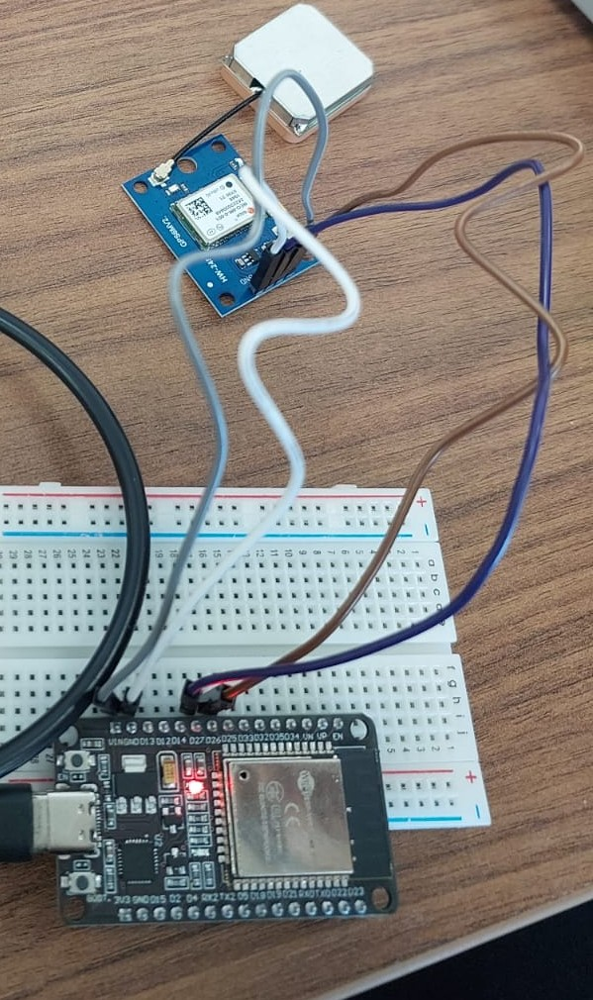

# GPS Tracker — ESP32 + NEO-6M

A real-time GPS tracking system that displays live location and satellite 
count on an interactive web map.
built on ESP32 with Firebase as backend.

## Demo

## What It Does
- Reads GPS coordinates and satellite count from NEO-6M module
- Sends live data to Firebase Realtime Database
- Displays real-time position on an interactive map via local web dashboard

## Hardware
| Component | Details |
|---|---|
| Microcontroller | ESP32 |
| GPS Module | NEO-6M |

## Wiring

## Libraries Used
- [TinyGPSPlus](https://github.com/mikalhart/TinyGPSPlus) — GPS data parsing
- [Firebase ESP32 Client](https://github.com/mobizt/Firebase-ESP32-Client) — Firebase communication

## How It Works
1. NEO-6M reads GPS coordinates and satellite count
2. ESP32 parses data using TinyGPSPlus
3. Data pushed to Firebase Realtime Database in real time
4. Local web dashboard reads Firebase and renders position on map using Leaflet.js

## Setup
1. Create a Firebase Realtime Database
2. Replace `YOUR_FIREBASE_DATABASE_URL` in `index.html` with your database URL
3. Copy `src/config.h.example` to `src/config.h` and fill in your credentials
4. Flash `src/main.cpp` to your ESP32 using PlatformIO
5. Open `index.html` in your browser

## Built With
- PlatformIO
- Firebase Realtime Database
- HTML / CSS / JavaScript
- Leaflet.js

## Author
Anas El-Bouzidi — ENIAD Berkane, Robotique et Objets Connectés
